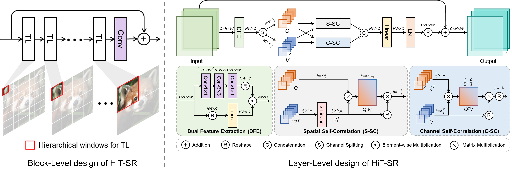
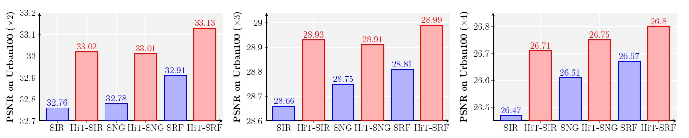
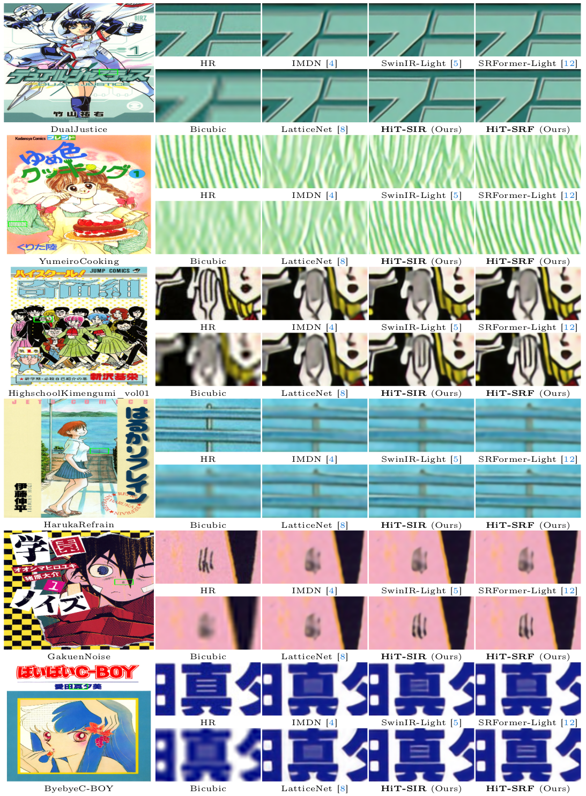

<p align="center">
  <h1 align="center">HiT-SR: <br> Hierarchical Transformer  for Efficient Image Super-Resolution</h1>
  <p align="center">
    <a href="https://xiangz-0.github.io/">Xiang Zhang</a>
    ·
    <a href="http://yulunzhang.com/">Yulun Zhang</a>
    ·
    <a href="https://www.yf.io/">Fisher Yu</a>
  </p>
  <h3 align="center"><a href="">[Paper]</a> | <a href="">[Supp]</a> | <a href="https://1drv.ms/f/s!AgjOZB4WHoLekVPr-wOvZU49ZDif?e=T207H7">[Visual Results]</a> | <a href="https://1drv.ms/f/s!AgjOZB4WHoLekVJIjZwm5EXdBGW2?e=XS359Y">[Models]</a> </h3>
  <div align="center"></div>
</p>


---

> **Abstract:** *Transformers have exhibited promising performance in computer vision tasks including image super-resolution (SR). However, transformer-based SR methods often employ window self-attention with quadratic computational complexity to window sizes, resulting in fixed small windows with limited receptive fields. In this paper, we present a general strategy to convert transformer-based SR networks to hierarchical transformers (HiT-SR), boosting SR performance with multi-scale features while maintaining an efficient design. Specifically, we first replace the commonly used fixed small windows with expanding hierarchical windows to aggregate features at different scales and establish long-range dependencies. Considering the intensive computation required for large windows, we further design a spatial-channel correlation method with linear complexity to window sizes, efficiently gathering spatial and channel information from hierarchical windows. Extensive experiments verify the effectiveness and efficiency of our HiT-SR, and our improved versions of SwinIR-Light and SwinIR-NG establish state-of-the-art results for efficient image SR.* 


<p align="center">
  
</p>

<p align="center">
  
</p>


<!--  -->

## Environment Setup

- Python 3.8
- PyTorch 1.13.0 + Torchvision 0.14.0
- NVIDIA GPU + [CUDA](https://developer.nvidia.com/cuda-downloads)

```bash
git clone https://github.com/XiangZ-0/HiT-SR.git
conda create -n HiTSR python=3.8
conda activate HiTSR
pip install -r requirements.txt
python setup.py develop
```

## Contents

1. [Datasets](#Datasets)
1. [Models](#Models)
1. [Training](#Training)
1. [Testing](#Testing)
1. [Results](#Results)
1. [Citation](#Citation)
1. [Acknowledgements](#Acknowledgements)

---

## Datasets

Training and testing sets can be downloaded as follows:

| Training Set                                                 |                         Testing Set                          |                        Visual Results                        |
| :-----------------------------------------------------------: | :----------------------------------------------------------: | :----------------------------------------------------------: |
| [DIV2K](https://data.vision.ee.ethz.ch/cvl/DIV2K/) (800 training images, 100 validation images) +  [Flickr2K](https://cv.snu.ac.kr/research/EDSR/Flickr2K.tar) (2650 images) [complete training dataset DF2K: [Google Drive](https://drive.google.com/file/d/1TubDkirxl4qAWelfOnpwaSKoj3KLAIG4/view?usp=share_link) / [Baidu Disk](https://pan.baidu.com/s/1KIcPNz3qDsGSM0uDKl4DRw?pwd=74yc)] | Set5 + Set14 + BSD100 + Urban100 + Manga109 [complete testing dataset: [Google Drive](https://drive.google.com/file/d/1yMbItvFKVaCT93yPWmlP3883XtJ-wSee/view?usp=sharing) / [Baidu Disk](https://pan.baidu.com/s/1Tf8WT14vhlA49TO2lz3Y1Q?pwd=8xen)] | [One Drive](https://1drv.ms/f/s!AgjOZB4WHoLekVPr-wOvZU49ZDif?e=fnHUhz) |

Download training and testing datasets and put them into the corresponding folders of `datasets/`. See [datasets](datasets/README.md) for the detail of the directory structure.

## Models

| Method    | #Param. (K) | FLOPs (G) | Dataset  | PSNR (dB) |  SSIM  |                          Model Zoo                           |                        Visual Results                        |
| :-------- | :----: | :-------: | :------: | :-------: | :----: | :----------------------------------------------------------: | :----------------------------------------------------------: |
| HiT-SIR-S     | 495 |  137.4   | Urban100 (x2) |  39.32   | 0.9785 | [One Drive](https://1drv.ms/f/s!AgjOZB4WHoLekVciOEScWJ9yajc8?e=clWshj) | [One Drive](https://1drv.ms/u/s!AgjOZB4WHoLekVSH71Pxz0gIkmiz?e=AU0LsH) |
| HiT-SIR       | 772 |  209.9   | Urban100 (x2) |   39.50   | 0.9788 | [One Drive](https://1drv.ms/f/s!AgjOZB4WHoLekViu2GbilwkRwYQG?e=MhzzPi)  | [One Drive](https://1drv.ms/u/s!AgjOZB4WHoLekVZ2Jqg5g9cO8Oot?e=hhNNvD)  |
| HiT-SNG    | 1013 |  213.9   | Urban100 (x2) |   39.51   | 0.9789 | [One Drive](https://1drv.ms/f/s!AgjOZB4WHoLekVmvlzdkQOVBV_29?e=okydd1) | [One Drive](https://1drv.ms/u/s!AgjOZB4WHoLekVVLQaDMqWXJgqkJ?e=MwSggK) |

The output size is set to 3x1280x720 to compute FLOPs. 

## Training

- Download [training](https://drive.google.com/file/d/1TubDkirxl4qAWelfOnpwaSKoj3KLAIG4/view?usp=share_link) (DF2K, already processed) and [testing](https://drive.google.com/file/d/1yMbItvFKVaCT93yPWmlP3883XtJ-wSee/view?usp=sharing) (Set5, Set14, BSD100, Urban100, Manga109, already processed) datasets, place them in `datasets/`.

- Run the following scripts. The training configuration is in `options/train/`.

  ```shell
  # HiT-SIR-S, input=64x64, 4 GPUs
  python -m torch.distributed.launch --nproc_per_node=4 --master_port=1234 basicsr/train.py -opt options/Train/train_HiT_SIR_S_x2.yml --launcher pytorch
  python -m torch.distributed.launch --nproc_per_node=4 --master_port=1234 basicsr/train.py -opt options/Train/train_HiT_SIR_S_x3.yml --launcher pytorch
  python -m torch.distributed.launch --nproc_per_node=4 --master_port=1234 basicsr/train.py -opt options/Train/train_HiT_SIR_S_x4.yml --launcher pytorch
  
  # HiT-SIR, input=64x64, 4 GPUs
  python -m torch.distributed.launch --nproc_per_node=4 --master_port=1234 basicsr/train.py -opt options/Train/train_HiT_SIR_x2.yml --launcher pytorch
  python -m torch.distributed.launch --nproc_per_node=4 --master_port=1234 basicsr/train.py -opt options/Train/train_HiT_SIR_x3.yml --launcher pytorch
  python -m torch.distributed.launch --nproc_per_node=4 --master_port=1234 basicsr/train.py -opt options/Train/train_HiT_SIR_x4.yml --launcher pytorch
  
  # HiT-SNG, input=64x64, 4 GPUs
  python -m torch.distributed.launch --nproc_per_node=4 --master_port=4321 basicsr/train.py -opt options/Train/train_HiT_SNG_x2.yml --launcher pytorch
  python -m torch.distributed.launch --nproc_per_node=4 --master_port=4321 basicsr/train.py -opt options/Train/train_HiT_SNG_x3.yml --launcher pytorch
  python -m torch.distributed.launch --nproc_per_node=4 --master_port=4321 basicsr/train.py -opt options/Train/train_HiT_SNG_x4.yml --launcher pytorch
  ```

- The training experiments will be stored in `experiments/`.

## Testing

### Test with ground-truth images

- Download the [pre-trained models](https://1drv.ms/f/s!AgjOZB4WHoLekVJIjZwm5EXdBGW2?e=XS359Y) and place them in `experiments/pretrained_models/`.

  We provide pre-trained models for efficient image SR: HiT-SIR-S, HiT-SIR, and HiT-SNG (x2, x3, x4).

- Download [testing datasets](https://drive.google.com/file/d/1yMbItvFKVaCT93yPWmlP3883XtJ-wSee/view?usp=sharing) (Set5, Set14, BSD100, Urban100, Manga109), place them in `datasets/`.

- Run the following scripts. The testing configuration is in `options/Test/` (e.g., [test_HiT_SIR_x2.yml](options/Test/test_HiT_SIR_x2.yml)).

  Note 1:  You can set `use_chop: True` (default: False) in YML to chop the image for testing.

  ```shell
  # No self-ensemble
  # HiT-SIR-S, reproduces results in Table 2 of the main paper
  python basicsr/test.py -opt options/Test/test_HiT_SIR_S_x2.yml
  python basicsr/test.py -opt options/Test/test_HiT_SIR_S_x3.yml
  python basicsr/test.py -opt options/Test/test_HiT_SIR_S_x4.yml
  
  # HiT-SIR, reproduces results in Table 2 of the main paper
  python basicsr/test.py -opt options/Test/test_HiT_SIR_x2.yml
  python basicsr/test.py -opt options/Test/test_HiT_SIR_x3.yml
  python basicsr/test.py -opt options/Test/test_HiT_SIR_x4.yml
  
  # HiT-SNG, reproduces results in Table 2 of the main paper
  python basicsr/test.py -opt options/Test/test_HiT_SNG_x2.yml
  python basicsr/test.py -opt options/Test/test_HiT_SNG_x3.yml
  python basicsr/test.py -opt options/Test/test_HiT_SNG_x4.yml
  ```

- The output is stored in `results/`. All visual results of our pre-trained models can be accessed via [one drive](https://1drv.ms/f/s!AgjOZB4WHoLekVPr-wOvZU49ZDif?e=T207H7).

### Test without ground-truth images

- Download the [pre-trained models](https://1drv.ms/f/s!AgjOZB4WHoLekVJIjZwm5EXdBGW2?e=XS359Y) and place them in `experiments/pretrained_models/`.

  We provide pre-trained models for efficient image SR: HiT-SIR-S, HiT-SIR, and HiT-SNG (x2, x3, x4).

- Put your dataset (single LR images) in `datasets/single`. Some example images are in this folder.

- Run the following scripts. The testing configuration is in `options/test/` (e.g., [test_single_x2.yml](options/Test/test_single_x2.yml)).

  Note 1: The default model is HiT-SIR. You can use other models like HiT-SNG by modifying the YML.

  Note 2:  You can set `use_chop: True` (default: False) in YML to chop the image for testing.

  ```shell
  # Test on your dataset without ground-truth images
  python basicsr/test.py -opt options/Test/test_single_x2.yml
  python basicsr/test.py -opt options/Test/test_single_x3.yml
  python basicsr/test.py -opt options/Test/test_single_x4.yml
  ```

- The output is stored in `results/`.

## Results

We apply our HiT-SR approach to improve [SwinIR-Light](https://github.com/JingyunLiang/SwinIR) and [SwinIR-NG](https://github.com/rami0205/NGramSwin), corresponding to our HiT-SIR and HiT-SNG. We also reduce the channel dimension of HiT-SIR and provide a lighter model HiT-SIR-S. Compared with the original structure, our improved models achieve better SR performance while reducing computational burdens.

- Performance improvements of HiT-SR (SIR and SNG indicate SwinIR-Light and SwinIR-NG, respectively).
<p align="center">
  
</p>

- Efficiency improvements of HiT-SR (SIR and SNG indicate SwinIR-Light and SwinIR-NG, respectively). The complexity metrics are calculated under x2 upscaling on an A100 GPU, with the output size set to 3x1280x720.
<p align="center">
  
</p>

- Convergence improvements of HiT-SR (SIR and SNG indicate SwinIR-Light and SwinIR-NG, respectively). Left two figures show the results on Urban100 (x2) dataset, and the right two are on Manga109 (x2) dataset.

<p align="center">
  
</p>

More detailed results can be found in the paper. All visual results of  can be downloaded [here](https://1drv.ms/f/s!AgjOZB4WHoLekVPr-wOvZU49ZDif?e=T207H7).

<details>
<summary>Click to expan</summary>

- Quantitative comparison

<p align="center">
  
</p>


- [Local attribution map (LAM)](https://x-lowlevel-vision.github.io/lam.html) comparison (more marked pixels indicate better information aggragation ability)

<p align="center">
  
</p>


- Qualitative comparison on challenging scenes

<p align="center">
  
</p>

<p align="center">
  
</p>

<p align="center">
  
</p>

</details>

## Citation

If you find the code helpful in your research or work, please consider citing the following paper.

```
@inproceedings{zhang2024hitsr,
    title={HiT-SR: Hierarchical Transformer for Efficient Image Super-Resolution},
    author={Zhang, Xiang and Zhang, Yulun and Yu, Fisher},
    booktitle={arXiv},
    year={2024}
}
```

## Acknowledgements

This code is built on [DAT](https://github.com/zhengchen1999/DAT), [SwinIR](https://github.com/JingyunLiang/SwinIR), and [BasicSR](https://github.com/XPixelGroup/BasicSR).
