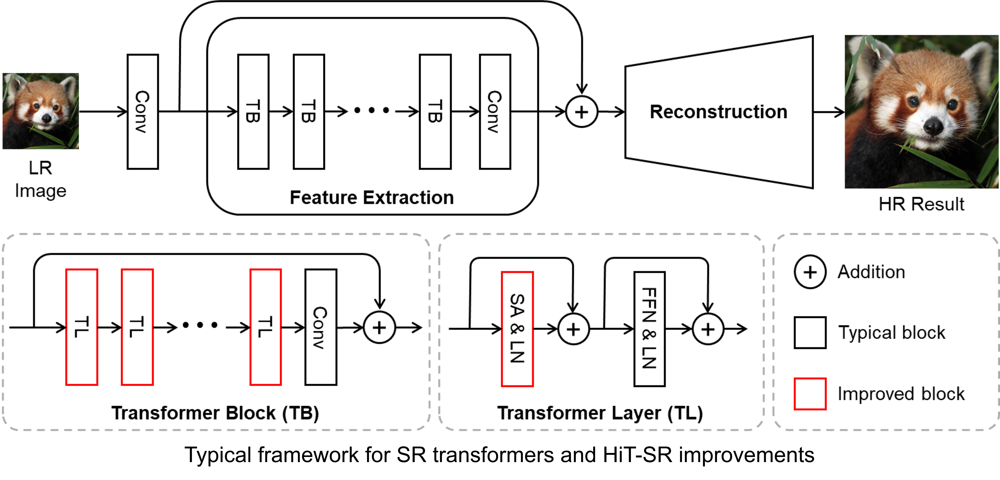
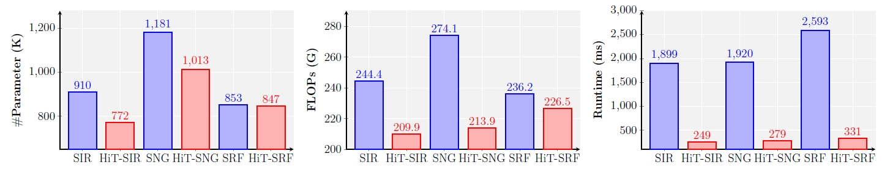
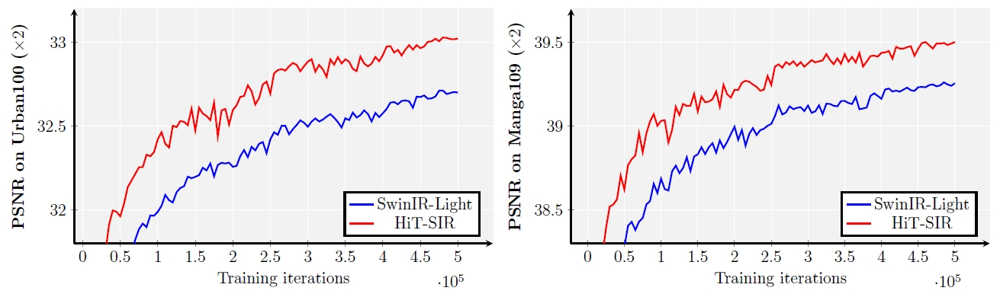
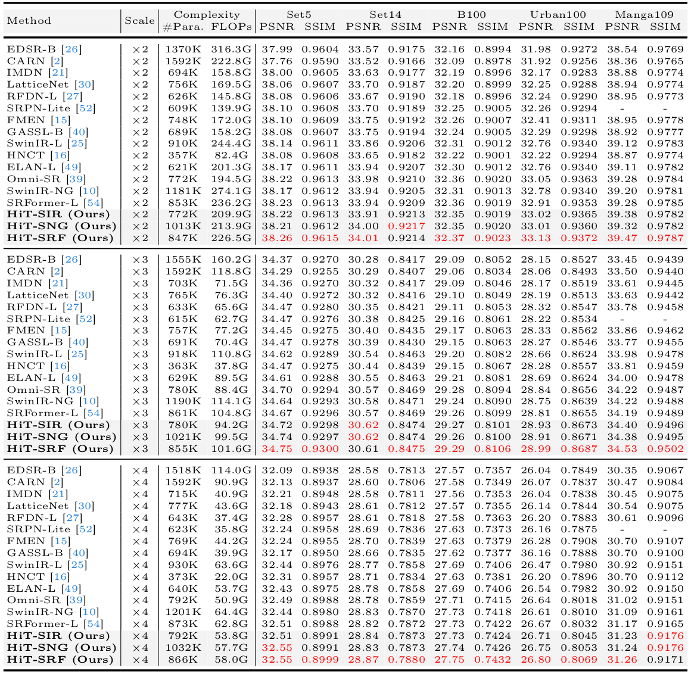
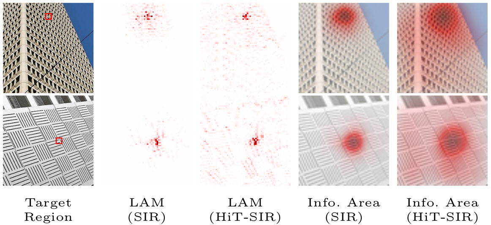
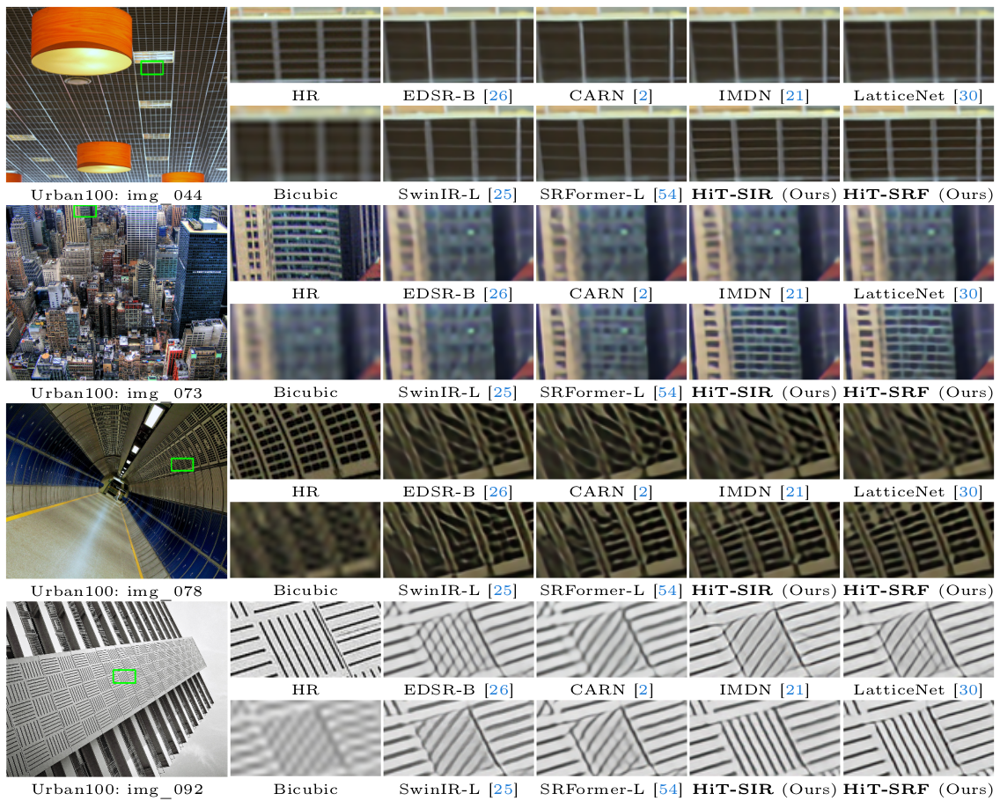
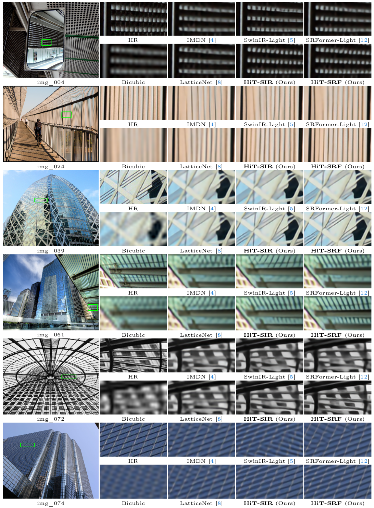

<p align="center">
  <h1 align="center">
 <br>
 Hierarchical Transformer <br>  for Efficient Image Super-Resolution</h1>
  <p align="center">
    <a href="https://xiangz-0.github.io/">Xiang Zhang</a><sup>1</sup>
    ·
    <a href="http://yulunzhang.com/">Yulun Zhang</a><sup>2</sup>
    ·
    <a href="https://www.yf.io/">Fisher Yu</a><sup>1</sup>
  </p>
  <p align="center">
    <sup>1</sup>ETH Zürich &nbsp; &nbsp;   <sup>2</sup>MoE Key Lab of Artificial Intelligence, Shanghai Jiao Tong University
  </p>
  <h3 align="center">
  ECCV 2024 - Oral
  </h3>
  <h3 align="center"><a href="https://1drv.ms/b/c/de821e161e64ce08/EVsrOr1-PFFMsXxiRHEmKeoBSH6DPkTuN2GRmEYsl9bvDQ?e=f9wGUO">[Paper]</a> | <a href="https://1drv.ms/b/c/de821e161e64ce08/EYmRy-QOjPdFsMRT_ElKQqABYzoIIfDtkt9hofZ5YY_GjQ?e=2Iapqf">[Supp]</a> | <a href="https://1drv.ms/f/c/de821e161e64ce08/EuE6xW-sN-hFgkIa6J-Y8gkB9b4vDQZQ01r1ZP1lmzM0vQ?e=aIRfCQ">[Visual Results]</a> | <a href="https://1drv.ms/f/c/de821e161e64ce08/EqakXUlsculBpo79VKpEXY4B_6OQL-fGyilrzpHaNObG1A?e=YNrqHb">[Models]</a> </h3>
  <div align="center"></div>
</p>


---

> **Abstract:** *Transformers have exhibited promising performance in computer vision tasks including image super-resolution (SR). However, popular transformer-based SR methods often employ window self-attention with quadratic computational complexity to window sizes, resulting in fixed small windows with limited receptive fields. In this paper, we present a general strategy to convert transformer-based SR networks to hierarchical transformers (HiT-SR), boosting SR performance with multi-scale features while maintaining an efficient design. Specifically, we first replace the commonly used fixed small windows with expanding hierarchical windows to aggregate features at different scales and establish long-range dependencies. Considering the intensive computation required for large windows, we further design a spatial-channel correlation method with linear complexity to window sizes, efficiently gathering spatial and channel information from hierarchical windows. Extensive experiments verify the effectiveness and efficiency of our HiT-SR, and our improved versions of SwinIR-Light, SwinIR-NG, and SRFormer-Light yield state-of-the-art SR results with fewer parameters, FLOPs, and faster speeds (~7x).* 


<!-- <p align="center">
  
</p> -->

<p align="center">
  
</p>


<!--  -->


## 📑 Contents

- [🛠️Setup](#%EF%B8%8F-Setup)
- [💿Datasets](#-Datasets)
- [🚀Models](#-Models)
- [🏋Training](#-Training)
- [🧪Testing](#-Testing)
- [📊Results](#-Results)
- [📎Citation](#-Citation)
- [🏅Acknowledgements](#-Acknowledgements)

---

## 🛠️ Setup

- Python 3.8
- PyTorch 1.8.0 + Torchvision 0.9.0
- NVIDIA GPU + [CUDA](https://developer.nvidia.com/cuda-downloads)

```bash
git clone https://github.com/XiangZ-0/HiT-SR.git
conda create -n HiTSR python=3.8
conda activate HiTSR
pip install -r requirements.txt
python setup.py develop
```

## 💿 Datasets

Training and testing sets can be downloaded as follows:

| Training Set                                                 |                         Testing Set                          |                        Visual Results                        |
| :-----------------------------------------------------------: | :----------------------------------------------------------: | :----------------------------------------------------------: |
| [DIV2K](https://data.vision.ee.ethz.ch/cvl/DIV2K/) (800 training images, 100 validation images) [organized training dataset DIV2K: [One Drive](https://1drv.ms/u/c/de821e161e64ce08/Eb1dyRMuCJBGjmtUUJd1j2EBbDhcSyHBYqUeqKjhuPb49Q?e=3RMxbs)] | Set5 + Set14 + BSD100 + Urban100 + Manga109 [complete testing dataset: [One Drive](https://1drv.ms/u/c/de821e161e64ce08/EUN4kTCUdBtNuvJnb2Jy3BkByBMErLIqpiQI4NG6HcAXWQ?e=3k5dGK)] | [One Drive](https://1drv.ms/f/c/de821e161e64ce08/EuE6xW-sN-hFgkIa6J-Y8gkB9b4vDQZQ01r1ZP1lmzM0vQ?e=hV5OOc) |

Download training and testing datasets and put them into the corresponding folders of `datasets/`. See [datasets](datasets/README.md) for the detail of the directory structure.

## 🚀 Models

| Method    | #Param. (K) | FLOPs (G) | Dataset  | PSNR (dB) |  SSIM  |                          Model Zoo                           |                        Visual Results                        |
| :-------- | :----: | :-------: | :------: | :-------: | :----: | :----------------------------------------------------------: | :----------------------------------------------------------: |
| HiT-SIR       | 792 |  53.8   | Urban100 (x4) |   26.71   | 0.8045 | [One Drive](https://1drv.ms/f/c/de821e161e64ce08/EhLkXZsiGV9HgjwjQIvNV3oBTKmSaTZfZ0-jIMMJtONN3w?e=PSos9v)  | [One Drive](https://1drv.ms/u/c/de821e161e64ce08/Eeya10xIX-dJsGVa3WJt2hkBnTeG3CTJFuP9tLdwBHBndg?e=fb1aM4)  |
| HiT-SNG    | 1032 |  57.7   | Urban100 (x4) |   26.75   | 0.8053 | [One Drive](https://1drv.ms/f/c/de821e161e64ce08/ElBD_V3wgy9KrotqdSoWyQoB2BhOUzcPxYkFQyQQp68jYA?e=Kz4LRw) | [One Drive](https://1drv.ms/u/c/de821e161e64ce08/Ee6a-XKo1qFKrTvgOiFlb4sBfNfyLBwHnMVj-vqfxO5YRA?e=pURhUB) |
| HiT-SRF     | 866 |  58.0   | Urban100 (x4) |  26.80   | 0.8069 | [One Drive](https://1drv.ms/f/c/de821e161e64ce08/ErtsTu3cbxdFnVPFJAcofY4BkwfGq5c0pGewFIBNTkujrg?e=wLd1n1) | [One Drive](https://1drv.ms/u/c/de821e161e64ce08/ET9b9T7PdDdGr8T7EFdX8OkBzK3vBe1drGD-LAcyGYgr-g?e=aYGwOP) |

The output size is set to 1280x720 to compute FLOPs. 

## 🏋 Training

- Download [training](https://1drv.ms/u/c/de821e161e64ce08/Eb1dyRMuCJBGjmtUUJd1j2EBbDhcSyHBYqUeqKjhuPb49Q?e=3RMxbs) (DIV2K, already processed) and [testing](https://1drv.ms/u/c/de821e161e64ce08/EUN4kTCUdBtNuvJnb2Jy3BkByBMErLIqpiQI4NG6HcAXWQ?e=3k5dGK) (Set5, Set14, BSD100, Urban100, Manga109, already processed) datasets, place them in `datasets/`.

- Run the following scripts. The training configuration is in `options/Train/`.

  ```shell
  # HiT-SIR, input=64x64, 4 GPUs
  python -m torch.distributed.launch --nproc_per_node=4 --master_port=1234 basicsr/train.py -opt options/Train/train_HiT_SIR_x2.yml --launcher pytorch
  python -m torch.distributed.launch --nproc_per_node=4 --master_port=1234 basicsr/train.py -opt options/Train/train_HiT_SIR_x3.yml --launcher pytorch
  python -m torch.distributed.launch --nproc_per_node=4 --master_port=1234 basicsr/train.py -opt options/Train/train_HiT_SIR_x4.yml --launcher pytorch
  
  # HiT-SNG, input=64x64, 4 GPUs
  python -m torch.distributed.launch --nproc_per_node=4 --master_port=4321 basicsr/train.py -opt options/Train/train_HiT_SNG_x2.yml --launcher pytorch
  python -m torch.distributed.launch --nproc_per_node=4 --master_port=4321 basicsr/train.py -opt options/Train/train_HiT_SNG_x3.yml --launcher pytorch
  python -m torch.distributed.launch --nproc_per_node=4 --master_port=4321 basicsr/train.py -opt options/Train/train_HiT_SNG_x4.yml --launcher pytorch

  # HiT-SRF, input=64x64, 4 GPUs
  python -m torch.distributed.launch --nproc_per_node=4 --master_port=1234 basicsr/train.py -opt options/Train/train_HiT_SRF_x2.yml --launcher pytorch
  python -m torch.distributed.launch --nproc_per_node=4 --master_port=1234 basicsr/train.py -opt options/Train/train_HiT_SRF_x3.yml --launcher pytorch
  python -m torch.distributed.launch --nproc_per_node=4 --master_port=1234 basicsr/train.py -opt options/Train/train_HiT_SRF_x4.yml --launcher pytorch
  ```

- The training experiments will be stored in `experiments/`.

## 🧪 Testing

### Test with ground-truth images

- Download the [pre-trained models](https://1drv.ms/f/c/de821e161e64ce08/EqakXUlsculBpo79VKpEXY4B_6OQL-fGyilrzpHaNObG1A?e=YNrqHb) and place them in `experiments/pretrained_models/`.

  We provide pre-trained models for efficient image SR: HiT-SIR, HiT-SNG, and HiT-SRF (x2, x3, x4).

- Download [testing datasets](https://1drv.ms/u/c/de821e161e64ce08/EUN4kTCUdBtNuvJnb2Jy3BkByBMErLIqpiQI4NG6HcAXWQ?e=3k5dGK) (Set5, Set14, BSD100, Urban100, Manga109), place them in `datasets/`.

- Run the following scripts. The testing configuration is in `options/Test/` (e.g., [test_HiT_SIR_x2.yml](options/Test/test_HiT_SIR_x2.yml)).

  Note 1:  You can set `use_chop: True` (default: False) in YML to chop the image for testing.

  ```shell
  # No self-ensemble
  # HiT-SIR, reproduces results in Table 2 of the main paper
  python basicsr/test.py -opt options/Test/test_HiT_SIR_x2.yml
  python basicsr/test.py -opt options/Test/test_HiT_SIR_x3.yml
  python basicsr/test.py -opt options/Test/test_HiT_SIR_x4.yml
  
  # HiT-SNG, reproduces results in Table 2 of the main paper
  python basicsr/test.py -opt options/Test/test_HiT_SNG_x2.yml
  python basicsr/test.py -opt options/Test/test_HiT_SNG_x3.yml
  python basicsr/test.py -opt options/Test/test_HiT_SNG_x4.yml

  # HiT-SRF, reproduces results in Table 2 of the main paper
  python basicsr/test.py -opt options/Test/test_HiT_SRF_x2.yml
  python basicsr/test.py -opt options/Test/test_HiT_SRF_x3.yml
  python basicsr/test.py -opt options/Test/test_HiT_SRF_x4.yml
  ```

- The output is stored in `results/`. All visual results of our pre-trained models can be accessed via [one drive](https://1drv.ms/f/c/de821e161e64ce08/EuE6xW-sN-hFgkIa6J-Y8gkB9b4vDQZQ01r1ZP1lmzM0vQ?e=aIRfCQ).

### Test without ground-truth images

- Download the [pre-trained models](https://1drv.ms/f/c/de821e161e64ce08/EqakXUlsculBpo79VKpEXY4B_6OQL-fGyilrzpHaNObG1A?e=YNrqHb) and place them in `experiments/pretrained_models/`.

  We provide pre-trained models for efficient image SR: HiT-SIR, HiT-SNG, and HiT-SRF (x2, x3, x4).

- Put your dataset (single LR images) in `datasets/single`. Some example images are in this folder.

- Run the following scripts. The testing configuration is in `options/test/` (e.g., [test_single_x2.yml](options/Test/test_single_x2.yml)).

  Note 1: The default model is HiT-SRF. You can use other models like HiT-SIR by modifying the YML.

  Note 2:  You can set `use_chop: True` (default: False) in YML to chop the image for testing.

  ```shell
  # Test on your dataset without ground-truth images
  python basicsr/test.py -opt options/Test/test_single_x2.yml
  python basicsr/test.py -opt options/Test/test_single_x3.yml
  python basicsr/test.py -opt options/Test/test_single_x4.yml
  ```

- The output is stored in `results/`.

## 📊 Results


We apply our HiT-SR approach to improve [SwinIR-Light](https://github.com/JingyunLiang/SwinIR), [SwinIR-NG](https://github.com/rami0205/NGramSwin) and [SRFormer-Light](https://github.com/HVision-NKU/SRFormer), corresponding to our HiT-SIR, HiT-SNG, and HiT-SRF. Compared with the original structure, our improved models achieve better SR performance while reducing computational burdens.

- Performance improvements of HiT-SR (SIR, SNG, and SRF indicate SwinIR-Light, SwinIR-NG, and SRFormer-Light, respectively).
<p align="center">
  
</p>

- Efficiency improvements of HiT-SR (SIR, SNG, and SRF indicate SwinIR-Light, SwinIR-NG, and SRFormer-Light, respectively). The complexity metrics are calculated under x2 upscaling on an A100 GPU, with the output size set to 1280x720.
<p align="center">
  
</p>


- Overall improvements of HiT-SR
<p align="center">
  
</p>

- Convergence improvements of HiT-SR

<p align="center">
  
</p>

More detailed results can be found in the paper. All visual results of  can be downloaded [here](https://1drv.ms/f/c/de821e161e64ce08/EuE6xW-sN-hFgkIa6J-Y8gkB9b4vDQZQ01r1ZP1lmzM0vQ?e=aIRfCQ).

<details>
<summary>More results (click to expan)</summary>

- Quantitative comparison

<p align="center">
  
</p>


- [Local attribution map (LAM)](https://x-lowlevel-vision.github.io/lam.html) comparison (more marked pixels indicate better information aggragation ability)

<p align="center">
  
</p>


- Qualitative comparison on challenging scenes

<p align="center">
  
</p>

<p align="center">
  
</p>

<p align="center">
  
</p>

</details>

## 📎 Citation

If you find the code helpful in your research or work, please consider citing the following paper.

```
@inproceedings{zhang2024hitsr,
    title={HiT-SR: Hierarchical Transformer for Efficient Image Super-Resolution},
    author={Zhang, Xiang and Zhang, Yulun and Yu, Fisher},
    booktitle={ECCV},
    year={2024}
}
```

## 🏅 Acknowledgements

This project is built on [DAT](https://github.com/zhengchen1999/DAT), [SwinIR](https://github.com/JingyunLiang/SwinIR), [NGramSwin](https://github.com/rami0205/NGramSwin), [SRFormer](https://github.com/HVision-NKU/SRFormer), and [BasicSR](https://github.com/XPixelGroup/BasicSR). Special thanks to their excellent works!
